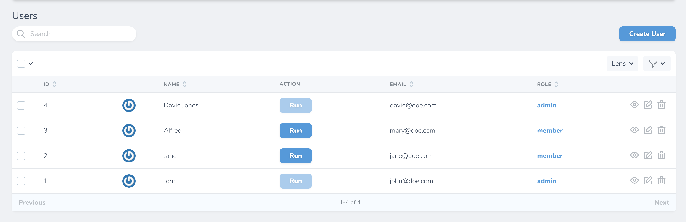

# Nova Action Button

[](https://packagist.org/packages/pdmfc/nova-action-button)


This package allows you to execute an action directly on your resource table view.

## Installation

```shell
composer require pdmfc/nova-action-button
```

## Usage

```php
use App\Nova\Actions\ChangeRole;
use Pdmfc\NovaFields\ActionButton;

//...

public function fields()
{
    return [
        ActionButton::make('Action')
            ->action(ChangeRole::class, $this->id)
    ];
}
```

The `action()` method requires two params - the action class name, and the target resource id. 


---

### Disabling button

You can use the native Laravel nova [readonly()](https://nova.laravel.com/docs/3.0/resources/fields.html#readonly-fields) method to prevent users from clicking the button:

```php
ActionButton::make('Action')
    ->action(ChangeRole::class, $this->id)
    ->readonly(function () {
        return $this->role->name === 'admin';
    })
```




## How to contribute

- clone the repo
- on `composer.json` of a laravel nova application add the following:

```
{
    //...

    "require" {
        "pdmfc/nova-action-button: "*"
    },

    //...
    "repositories": [
        {
            "type": "path",
            "url": "../path_to_your_package_folder"
        }
    ],
}
```

- run `composer update pdmfc/nova-action-button`

You're now ready to start contributing!
